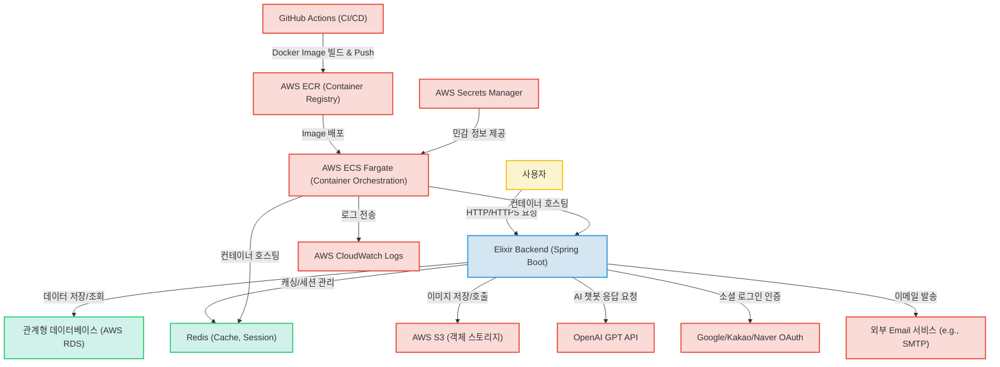

# Elixir Backend 서비스

## 🌟 프로젝트 소개

`Elixir Backend`는 Spring Boot 기반의 안정적인 RESTful API 서버로, 사용자 인증, 챌린지, 식단 기록, 레시피 관리, 그리고 OpenAI GPT API를 연동한 지능형 챗봇 등 다양한 핵심 도메인 서비스를 제공합니다. 이 프로젝트는 현대적인 클라우드 환경에 최적화된 아키텍처를 지향하며, 효율적인 개발 및 배포를 위한 CI/CD 파이프라인을 구축했습니다.

프로젝트명 'Elixir'는 특정 비즈니스 도메인(예: 건강 증진, 웰빙 솔루션)과 연관될 것으로 추정되며, 사용자들에게 삶의 질을 높이는 '묘약'과 같은 가치를 제공하고자 하는 서비스 목표를 담고 있을 것으로 예상합니다.

## ✨ 주요 기능

이 프로젝트는 다음과 같은 핵심 기능을 제공합니다:

*   **사용자 인증 및 권한 관리**: JWT(JSON Web Token) 기반의 인증 시스템과 Google, Kakao, Naver 소셜 로그인을 통합하여 안전하고 편리한 사용자 로그인/가입 경험을 제공합니다.
*   **AI 챗봇 서비스**: OpenAI GPT API를 연동하여 사용자 질의에 응답하고 대화 세션을 관리하는 지능형 챗봇 기능을 제공합니다.
*   **식단 기록 및 관리**: (추정) 사용자의 식단을 기록하고 관리하는 기능을 제공합니다.
*   **챌린지 및 업적 시스템**: (추정) 사용자들이 목표를 설정하고 달성하며 보상을 얻을 수 있는 도전과제 및 업적 시스템을 지원합니다.
*   **레시피 관리**: (추정) 다양한 레시피 정보를 제공하고 관리하는 기능을 포함합니다.
*   **추천 시스템**: (추정) 사용자 데이터를 기반으로 맞춤형 콘텐츠(예: 식단, 챌린지)를 추천하는 기능을 구현합니다.
*   **파일 업로드 및 관리**: AWS S3를 활용하여 이미지 등 미디어 파일을 효율적으로 저장하고 관리합니다.

## 📁 프로젝트 구조

이 프로젝트의 상세 디렉토리 구조에 대한 정보는 제공되지 않았습니다. 하지만 아래 "핵심 파일 설명" 섹션을 통해 프로젝트의 주요 기능과 구조를 유추할 수 있습니다. 일반적인 Spring Boot 프로젝트 구조를 따르며, 도메인별 패키징을 통해 모듈성을 확보했을 것으로 예상합니다.

## 🔑 핵심 파일 설명

*   `src/main/java/BE_Elixir/Elixir/ElixirApplication.java`: Spring Boot 애플리케이션의 시작점으로, `@SpringBootApplication` 어노테이션을 통해 애플리케이션의 자동 설정을 담당하며, KST 타임존 설정 등 초기 구동 환경을 정의합니다.
*   `build.gradle`: Gradle 빌드 설정 파일로, 프로젝트의 모든 의존성(Spring Boot Starter, JPA, Redis, Security, JWT, Swagger, AWS S3, OpenAI API 클라이언트 등)을 관리하고, 빌드 스크립트를 정의하여 프로젝트의 기술 스택과 외부 연동 요소를 파악하는 데 중요합니다.
*   `src/main/java/BE_Elixir/Elixir/global/security/SecurityConfig.java`: 애플리케이션의 전반적인 보안 정책을 정의하는 Spring Security 설정 파일입니다. JWT 인증 필터(`JwtAuthenticationFilter`)를 등록하고, CORS 설정, 특정 URL에 대한 접근 허용 규칙(화이트리스트), 세션 관리 정책(STATELESS) 등을 구성하여 REST API의 보안을 담당합니다.
*   `src/main/java/BE_Elixir/Elixir/domain/auth/controller/AuthController.java`: 사용자 인증 및 인가 관련 API 엔드포인트(로그인, 소셜 로그인, 로그아웃, Access Token 재발급)를 정의하고 처리하는 컨트롤러입니다. `AuthService`, `JwtProvider`, `RedisAuthService`와 연동하여 사용자 인증 플로우를 관리합니다.
*   `src/main/java/BE_Elixir/Elixir/domain/chatbot/service/ChatbotService.java`: AI 챗봇의 핵심 로직을 구현한 서비스 클래스입니다. 사용자 질의를 받아 `GptConfig`를 통해 OpenAI GPT API를 호출하고, `RedisChatbotService`를 이용하여 대화 세션 및 히스토리를 관리하여 챗봇의 대화 흐름을 제어합니다.
*   `Dockerfile`: 애플리케이션을 도커 이미지로 빌드하기 위한 명령어들을 정의합니다. Gradle 빌드 환경에서 JAR 파일을 생성하고, 이를 OpenJDK 런타임 이미지에 복사하여 최종 실행 가능한 컨테이너 이미지를 만드는 과정을 명시하여 컨테이너 기반 배포를 가능하게 합니다.
*   `task-definition.json`: AWS ECS (Elastic Container Service)에 애플리케이션을 배포하기 위한 태스크 정의 파일입니다. 백엔드 컨테이너(`elixir-container`)와 Redis 컨테이너(`redis-container`)를 정의하며, 각 컨테이너의 이미지, 포트 매핑, 환경 변수, AWS Secrets Manager를 통한 민감 정보 주입, 로깅 설정 등을 포함하여 AWS Fargate 환경에서의 컨테이너 오케스트레이션을 관리합니다.

## 🛠️ 기술 스택

### Frontend
해당 프로젝트는 백엔드 전용 리포지토리로, 프론트엔드 기술 스택은 포함되어 있지 않습니다. 강력한 백엔드 API 개발에 집중했습니다.

### Backend
*   **Java 17**: 최신 LTS 버전으로, 안정성과 성능 향상된 기능을 활용하여 비즈니스 로직을 효율적으로 구현했습니다.
*   **Spring Boot**: Spring Boot를 사용하여 빠르고 쉽게 RESTful API 서버를 구축하고, 의존성 관리 및 자동 설정을 통해 개발 생산성을 극대화했습니다.
*   **Spring Security + JWT**: Spring Security와 JWT를 활용하여 사용자 인증 및 권한 부여를 안전하게 처리하고, REST API의 보안을 강화했습니다.
*   **JPA / Hibernate**: JPA를 사용하여 객체 지향적으로 데이터베이스와 상호작용하며, 복잡한 SQL 쿼리 없이 데이터 영속성을 관리하여 개발 편의성을 높였습니다.
*   **Gradle**: Gradle을 통해 프로젝트의 빌드, 테스트, 배포 과정을 자동화하고 의존성 관리를 체계적으로 수행하여 개발 효율성을 높였습니다.
*   **Swagger / Springdoc-openapi**: Swagger를 통해 API 문서를 자동 생성하고 시각화하여, 프론트엔드 개발자 및 팀원들과의 API 명세 공유 및 협업을 원활하게 진행했습니다.
*   **OpenAI GPT API**: OpenAI GPT API를 연동하여 챗봇 기능을 구현하고, 사용자에게 AI 기반의 지능적인 정보 제공 및 상호작용 경험을 제공했습니다.
*   **Social Login (Google, Kakao, Naver)**: Google, Kakao, Naver 소셜 로그인을 통합하여 사용자 편의성을 높이고, 간편한 회원가입 및 로그인 경험을 제공했습니다.
*   **Spring Event**: Spring의 이벤트 발행/구독 모델을 활용하여 서비스 간의 느슨한 결합을 유지하고, 특정 액션 발생 시 여러 관련 로직을 비동기적으로 처리했습니다.

### Database
*   **RDB (SQL Database, AWS RDS 추정)**: RDB를 사용하여 정형 데이터를 안정적으로 저장하고 관리하며, 트랜잭션의 ACID 속성을 보장하여 데이터 무결성을 유지했습니다.
*   **Redis**: Redis를 사용하여 JWT Refresh Token 관리, 챗봇 세션, 이메일 인증 코드 등 휘발성 데이터를 빠르게 저장 및 조회하여 애플리케이션의 성능과 확장성을 향상시켰습니다.

### DevOps
*   **Docker**: Docker를 사용하여 애플리케이션과 그 종속성을 컨테이너로 패키징하여, 개발, 테스트, 운영 환경 간의 일관성을 확보하고 배포를 용이하게 했습니다.
*   **AWS ECS Fargate**: AWS ECS Fargate를 활용하여 서버리스 컨테이너 오케스트레이션을 구현하고, 인프라 관리 부담 없이 애플리케이션의 확장성과 고가용성을 확보했습니다.
*   **GitHub Actions (CI/CD)**: GitHub Actions를 통해 코드 변경 시 자동으로 빌드, 테스트, 배포를 수행하는 CI/CD 파이프라인을 구축하여, 개발 프로세스를 자동화하고 배포 주기를 단축했습니다.
*   **AWS S3**: AWS S3를 사용하여 이미지 및 대용량 파일을 안전하고 효율적으로 저장 및 관리하며, 확장성 있는 미디어 저장 인프라를 구축했습니다.
*   **AWS Secrets Manager**: AWS Secrets Manager를 사용하여 데이터베이스 비밀번호, API 키 등 민감 정보를 안전하게 저장하고 관리하며, 애플리케이션 보안을 강화했습니다.
*   **AWS CloudWatch Logs**: AWS CloudWatch Logs를 사용하여 컨테이너화된 애플리케이션의 로그를 중앙에서 수집하고 모니터링하여, 문제 진단 및 시스템 운영 가시성을 확보했습니다.

## 🏛️ 시스템 아키텍처

이 프로젝트는 Spring Boot 기반의 백엔드 API 서버로, 사용자 인증(JWT 및 소셜 로그인 연동), 챌린지, 식단 기록, 레시피 관리, 챗봇(OpenAI GPT 연동) 등 다양한 도메인 서비스를 제공합니다. 데이터는 관계형 데이터베이스(AWS RDS 추정)에 영구 저장되며, Redis를 활용하여 캐싱, JWT Refresh Token 관리, 챗봇 세션 유지 등 성능 향상 및 기능 보조를 수행합니다. 애플리케이션은 Docker 컨테이너로 빌드되어 AWS ECS Fargate에 배포되며, AWS S3를 통해 미디어 파일(이미지)을 저장하고, AWS Secrets Manager로 민감 정보를 안전하게 관리합니다. GitHub Actions를 사용하여 CI/CD 파이프라인을 자동화하여 개발 및 배포 효율성을 높였으며, AWS CloudWatch Logs를 통해 시스템 운영 가시성을 확보합니다.

## 🚀 실행 방법

추가 작성 필요: 프로젝트 실행을 위한 구체적인 빌드 및 실행 지침이 필요합니다.

## 💡 기술 선택 이유

*   **Java 17**: 최신 LTS 버전으로, 향상된 안정성과 성능을 바탕으로 비즈니스 로직을 효율적으로 구현할 수 있어 선택했습니다.
*   **Spring Boot**: 빠르고 쉽게 RESTful API 서버를 구축하고, 의존성 관리 및 자동 설정을 통해 개발 생산성을 극대화하기 위해 선택했습니다.
*   **Spring Security + JWT**: 사용자 인증 및 권한 부여를 안전하게 처리하고, REST API의 보안을 강화하는 데 효과적이라고 판단하여 도입했습니다.
*   **JPA / Hibernate**: 객체 지향적으로 데이터베이스와 상호작용하며, 복잡한 SQL 쿼리 없이 데이터 영속성을 관리하여 개발 편의성을 높일 수 있어 선택했습니다.
*   **Gradle**: 프로젝트의 빌드, 테스트, 배포 과정을 자동화하고 의존성 관리를 체계적으로 수행하여 개발 효율성을 높이는 데 기여합니다.
*   **Swagger / Springdoc-openapi**: API 문서를 자동 생성하고 시각화하여, 프론트엔드 개발자 및 팀원들과의 API 명세 공유 및 협업을 원활하게 진행하기 위해 도입했습니다.
*   **OpenAI GPT API**: 챗봇 기능을 구현하고, 사용자에게 AI 기반의 지능적인 정보 제공 및 상호작용 경험을 제공하기 위한 핵심 기술로 선택했습니다.
*   **Social Login (Google, Kakao, Naver)**: 사용자 편의성을 높이고, 간편한 회원가입 및 로그인 경험을 제공하여 서비스 접근성을 향상시킵니다.
*   **Spring Event**: 서비스 간의 느슨한 결합을 유지하고, 특정 액션 발생 시 여러 관련 로직을 비동기적으로 처리하여 시스템 유연성을 높입니다.
*   **RDB (SQL Database, AWS RDS 추정)**: 정형 데이터를 안정적으로 저장하고 관리하며, 트랜잭션의 ACID 속성을 보장하여 데이터 무결성을 유지하는 데 적합합니다.
*   **Redis**: JWT Refresh Token 관리, 챗봇 세션, 이메일 인증 코드 등 휘발성 데이터를 빠르게 저장 및 조회하여 애플리케이션의 성능과 확장성을 향상시킬 수 있습니다.
*   **Docker**: 애플리케이션과 그 종속성을 컨테이너로 패키징하여, 개발, 테스트, 운영 환경 간의 일관성을 확보하고 배포를 용이하게 만듭니다.
*   **AWS ECS Fargate**: 서버리스 컨테이너 오케스트레이션을 구현하여 인프라 관리 부담 없이 애플리케이션의 확장성과 고가용성을 확보할 수 있습니다.
*   **GitHub Actions (CI/CD)**: 코드 변경 시 자동으로 빌드, 테스트, 배포를 수행하는 CI/CD 파이프라인을 구축하여, 개발 프로세스를 자동화하고 배포 주기를 단축시킵니다.
*   **AWS S3**: 이미지 및 대용량 파일을 안전하고 효율적으로 저장 및 관리하며, 확장성 있는 미디어 저장 인프라를 구축하는 데 최적화되어 있습니다.
*   **AWS Secrets Manager**: 데이터베이스 비밀번호, API 키 등 민감 정보를 안전하게 저장하고 관리하며, 애플리케이션 보안을 강화하기 위해 사용합니다.
*   **AWS CloudWatch Logs**: 컨테이너화된 애플리케이션의 로그를 중앙에서 수집하고 모니터링하여, 문제 진단 및 시스템 운영 가시성을 확보하는 데 필수적입니다.

## 📈 개선 방향

현재 프로젝트 분석을 바탕으로, 다음과 같은 개선 방향을 고려해볼 수 있습니다.

*   **프로젝트 목표 명확화**: 프로젝트명 'Elixir'가 담고 있는 구체적인 서비스 목표(예: 건강 증진, 특정 분야의 웰빙 솔루션)를 README나 별도 문서에 명확히 기술하여 프로젝트의 정체성을 강화할 수 있습니다.
*   **추천 시스템 알고리즘 상세 설계**: 현재 추정되는 추천 시스템(`recommendation` domain)의 구체적인 추천 알고리즘(예: 협업 필터링, 콘텐츠 기반)과 어떤 데이터를 기반으로 추천이 이루어지는지 상세하게 설계하고 문서화할 필요가 있습니다.
*   **챌린지 및 업적 시스템 구체화**: 도전과제 및 업적 시스템(`challenge`, `achievement` domain)에서 제공하는 도전과제의 종류, 달성 조건, 보상 체계 등에 대한 상세 내용을 정의하여 사용자 참여를 유도하고 기능을 확장할 수 있습니다.
*   **식단 기록 기능 확장**: 식단 기록(`dietLog` domain) 기능이 단순히 기록을 넘어 식단 분석 리포트, 영양소 계산, 맞춤형 식단 제안 등 추가적인 가치를 제공할 수 있도록 기능을 확장하는 방안을 모색할 수 있습니다.
*   **프론트엔드 연동 명세**: 백엔드 프로젝트이므로, 실제 서비스의 사용자 인터페이스(Frontend)와 어떻게 연동되는지, 프론트엔드 기술 스택은 무엇인지에 대한 정보를 추가하여 전체 서비스 구조에 대한 이해도를 높일 수 있습니다. (만약 별도의 프론트엔드 프로젝트가 있다면 해당 프로젝트를 참조하도록 명시)
*   **API 버전 관리 전략**: API의 발전과 확장을 고려하여 효과적인 API 버전 관리 전략(예: URI 버전 관리, Header 버전 관리)을 수립하고 적용하는 것을 고려해볼 수 있습니다.
*   **테스트 커버리지 확대**: 안정적인 서비스 운영을 위해 단위 테스트, 통합 테스트, 인수 테스트 등의 테스트 커버리지를 확대하고, 자동화된 테스트 파이프라인을 강화할 수 있습니다.
*   **에러 핸들링 및 로깅 강화**: 사용자 친화적인 에러 응답 및 상세한 로깅 전략을 수립하여 문제 발생 시 진단 및 해결을 용이하게 할 수 있습니다.